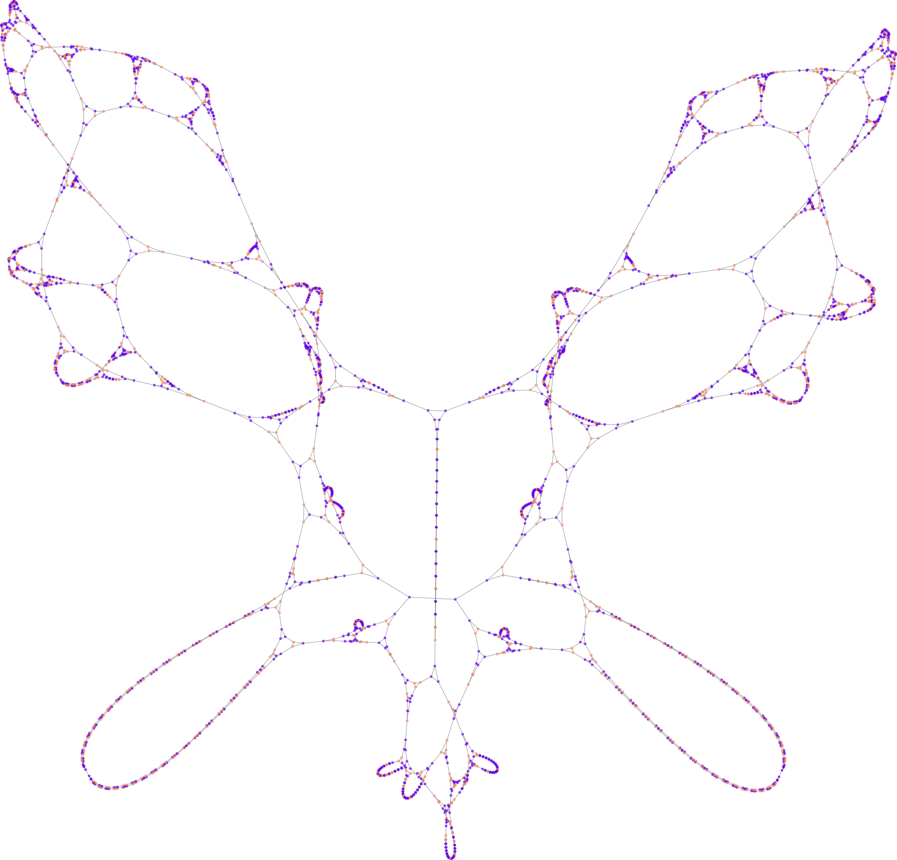

# Graph-Rewriting Automata
This repository contains the unofficial C++ implementation of [GRA](https://paulcousin.net/graph-rewriting-automata/index.html)


## Building 
```bash
cmake -B build
cmake --build build
```

## Usage
```bash
gra [Options]
```

### Options

| Flag | Long Flag        | Description                                             | Requirement                    |
|------|------------------|---------------------------------------------------------|--------------------------------|
| -r   | --rule <N\>       | Rule number. Must be in the range $[0,16^{d+1})$.      | Required                       |
| -i   | --iterations <N\> | Number of iterations to evolve the graph.               | Required                       |
| -d   | --degree <N\>     | Degree of the regular graph (d-regular). Maximum 127.   | Required (if no initial graph) |
| -g   | --initial <file\> | Path to the initial .graph file to load the state from. | Optional                       |
| -o   | --output <dir\>   | Output directory for generated graph files.             | Optional (Default: data)       |
|      | --export          | Export final graph to graphviz dot file                 | Optional                       |

More information about rules is available [here](https://paulcousin.net/graph-rewriting-automata/rules.html#rules).

If no initial graph is given, gra searchs for [minimal](https://paulcousin.net/graph-rewriting-automata/rules.html#minimal-graphs) d-regular graph.

### Help
```bash
gra -h
```

### Example
```bash
./build/gra --initial data/minimal3-1.graph -r 2238 -i 120 --export
```

## Visualization
| Rule 2238 - Iteration 120 |
| :---: |
|  |
| Layout generated using Gephi's ForceAtlas2 algorithm and rendered via SFML from JSON export. |


## References
- Cousin, P., & Maignan, A. (2022). Organic Structures Emerging from Bio-Inspired Graph-Rewriting Automata. 2022 24th International Symposium on Symbolic and Numeric Algorithms for Scientific Computing (SYNASC), 293–296. https://doi.org/10.1109/synasc57785.2022.00053
